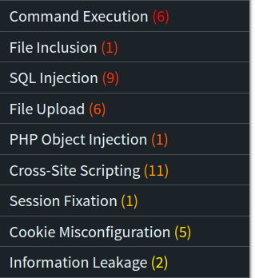
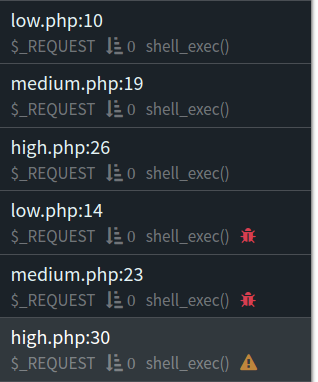
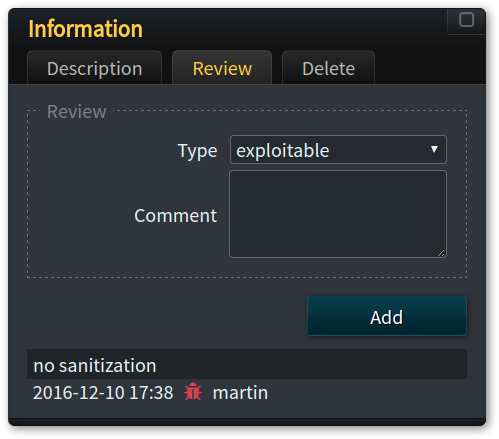
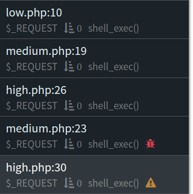
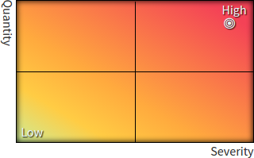

# Rescanning Applications with RIPS

11 Dec 2016 by Daniel Peeren

After an automated security analysis of an application with RIPS, the
application can be *rescanned* again. Within another round of security
analysis, implemented patches can be verified or the analysis settings
of the previous scan can be refined. In todays calendar post, we are
introducing some of the rescanning and reviewing features of RIPS based
on an example and see how *rescanning* works and what benefits it
brings.

## Benefits

One of the most important things in modern application development is to
think about security in every step of the development lifecycle.
Beginning with the start of the development right up until the continued
deployment of patches and features - security is important in all stages
of an application. With RIPS it is possible to rescan an application
before every release, build, feature, patch, or commit in order to
continuously ensure the application's security. This allows shorter
release cycles, less effort for security audits, and safer customers in
the long run.

The following case study shows one example of how RIPS can be used
continuously during the development / review process of an application
and how it simplifies the process altogether.

## Case Study DVWA

For our example, we will use the so called *Damn Vulnerable Web
Application* ^[1](#fn:1)^. DVWA is a project built for everyone who is
interested in security, either to test their hacking skills or to
evaluate different kinds of analysis tools. It has multiple intendet
security issues built-in that are categorized by their difficulty to
exploit. As an interesting side-note, RIPS was even able to find two
issues that were not intended nor documented by the authors: a SQL
injection in the setup routine and a [known PHP object
injection](https://sektioneins.de/en/advisories/advisory-022009-phpids-unserialize-vulnerability.html)
in the included PHPIDS 0.6 library.

To get started we downloaded the source code of DVWA and performed an
analysis with RIPS. As one can see in the diagram below, our analysis
was able to identify several security flaws within the application.



### Review Process

Since all results are generated in realtime there is no need to wait for
the analysis to finish. Instead, we can jump right in and start
reviewing security issues. For the sake of this case study we are going
to focus on the most critical vulnerabilities that can be found in web
applications: **command execution**. RIPS was able to detect 6 issues of
this kind in DVWA and we are going to review two of them: one in the
file called `low.php` and another one in the file `medium.php`. The
following code lines are affected.

```php
$target = $_REQUEST['ip'];
⋮
shell_exec('ping  -c 4 ' . $target);
```

```php
$target = $_REQUEST['ip'];
⋮
$substitutions = array('&&' => '', ';' => '');
$target = str_replace(array_keys($substitutions), $substitutions, $target);
⋮
shell_exec('ping  -c 4 ' . $target);
```

Both vulnerabilities in the code summaries above are easily identified
as exploitable because there is no (or not enough in the second case)
sanitization before the user input is used in the sensitive function
`shell_exec()`. Thus, in the web interface of RIPS, we mark two issues
as *exploitable* () and another one as *suspecious* ().





The next step would be to fix the vulnerabilities detected. In this
example, we only fix the vulnerability in the file named `low.php` by
quoting and escaping the shell arguements using the `escapeshellarg()`
function, as you can see in the code summary below in line 7.

```php
$target = $_REQUEST['ip'];
⋮
shell_exec('ping  -c 4 ' . escapeshellarg($target));
```

Additionally to these fixes, we added a new file to the project with the
following contents. Obviously, there is a simple cross-site scripting
vulnerability in the file that has to be detected within a rescan.

```php
<?php
echo 'Hello ' . $_GET['name'];
```

### Rescan

Now that the new version of our sample application is ready we can start
a new security analysis with RIPS using the previous results as the
*parent project*.


Apart from the modified code, the analysis in itself remains the same,
except that the review data provided by the user is now used to
highlight important statistics. In turn this allows to continuously work
on an application without the need for duplicated reviews. The analysis
results of the rescan are as follows.



In the issue list on the left, one can see that the review progress was
adopted from the previous analysis. The statistics on the right side
show the updated analysis results of the rescan. As expected, we fixed
one critical issue and added a medium one (XSS). A more detailed
comparison between the two versions can be found in the diagram below.
Here, a detailed comparison of vulnerability types is given by new, old,
and fixed issues. This provides a comprehensive overview whether our new
version of the application improved in terms of security, or the
opposite.

## What else is there?

### Global Top 10 Vulnerability Types

The diagram above depicts the top 10 most found vulnerability types in
all projects scanned and serves as an indication as to where developers
may need further training.

### Global Project Security Issues

Here, a timeline of the latest 20 projects and their security analysis
performance is shown. Over time, the amount of security issues should
drop as the developers are getting more and more familiar with different
types of security issues and the patch instructions reported by our
tool. It can be an interesting indication as to what direction a project
is heading and if further actions become necessary.

### Heatmap



Finally, RIPS also provides a real-time heatmap during security
analysis. It pinpoints an approximation of the overall security status
of the analyzed application based on the number of vulnerabilities found
and their severity. It indicates clearly that the *Damn Vulnerable Web
Application* should not be used in production.

## Summary

With rescans, RIPS is able to support managers, developers, and security
professionals alike in the review process. It is important to use these
security metrics because they offer critical information about the
overall security state and general architecture in order to ensure the
application's security from the beginning. At later stages of the
development lifecycle, this becomes more and more expensive if not
impossible.
