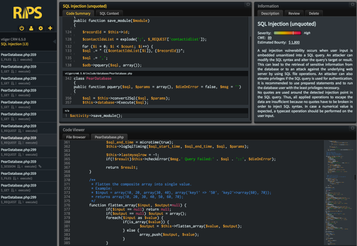
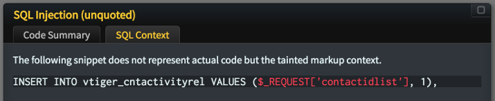
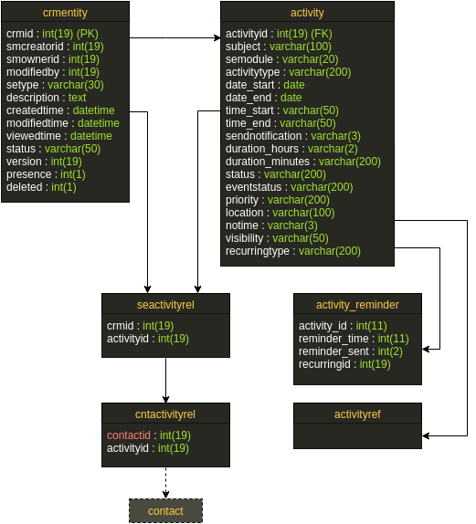

# Guest Post: Vtiger 6.5.0 - SQL Injection

15 Dec 2016 by Dennis Detering

The [Vtiger
CRM](https://www.vtiger.com/) is an open source Customer Relationship Management
software developed by Vtiger. With more than 4.5 million downloads on
SourceForge it enjoys great popularity. Some weeks ago, I had the chance
to play with RIPS and test its features - and was invited as guest
author to write this post. As I did some manual research of the Vtiger
CRM before and already found several vulnerabilities, I decided to use
it for my first experiments with RIPS.


## RIPS Analysis

RIPS analyzed the 27,371 files with around 650,000 lines of code in only
6 minutes. Due to the nature of a CRM system, it is necessary to have a
valid user account to access any of the provided features. Nevertheless,
the discovered issues allowed low-privileged users to access highly
sensitive data.

The truncated analysis results are available in our RIPS demo
application. Please note that we limited the results to the issues
described in this post in order to ensure a fix is available.

## Case Study

RIPS detected multiple issues, including a previously unknown SQL
injection vulnerability in the Calendar module, which will be explained
in the following.

### Example: SQL Injection



One great feature of RIPS is to show the chain of calling functions and
the exact context of the vulnerability. In this case, it showed that the
request parameter `contactidlist` was directly passed to a query string
without any sanitizing.



Taking a closer look at the source code revealed that `contactidlist` is
expected to be a semi-colon separated list of IDs, inserted into the
`vtiger_cntactivityrel` table to create a reference to the currently
edited calendar entry.

```php
if(isset($_REQUEST['contactidlist']) && $_REQUEST['contactidlist'] != '') {
    $adb->pquery('DELETE from vtiger_cntactivityrel WHERE activityid = ?', array($recordId));
        $contactIdsList = explode (';', $_REQUEST['contactidlist']);
        $count = count($contactIdsList);
        $sql = 'INSERT INTO vtiger_cntactivityrel VALUES ';
        for($i=0; $i<$count; $i++) {
            $sql .= " ($contactIdsList[$i], $recordId)";
            if ($i != $count - 1) {
                $sql .= ',';
            }
        }
        $adb->pquery($sql, array());
    }
```

As the injection could only be abused within an INSERT statement, it was
necessary to further inspect the database structure in order to
determine which kind of data and how many bytes might be used as
payload.



Due to the fact that `vtiger_cntactivityrel` is meant to be a connection
table for many-to-many relations between contacts and activities, both
values are of the type \"integer\" with the additional limit of
displaying at most 19 digits.

In order to exemplarily extract values of the user table, it was
necessary to use several MySQL functions to crop the read value,
transform it to its hex representation and convert it to an integer
(basis 10). With the given limit, it was possible to store 4 characters
per entry. The fact that `contactidlist` might contain multiple,
semi-colon separated values could be abused to insert multiple entries
at once and thus significantly increase the performance.

We were now able to insert (limited) arbitrary content to the database,
but needed a way to obtain the data somehow. Further analyzing the HTML
response of the calendar detail view, yielded the database value being
reflected as record parameter of the links to the related contact
entries.

```php
<label class="muted pull-right marginRight10px">Contact Name</label>
</td>
<td class="fieldValue medium" id="Events_detailView_fieldValue_contact_id">
    <span class="value" data-field-type="multireference">
    <a href='index.php?module=Contacts&view=Detail&record=1633971561' title='Contacts'></a><br>
    </span>
</td>
```

Converting the integer back to hex and then ASCII, finally resulted in
the first 4 characters of the user name `"admin"`:

    >>> binascii.unhexlify(format(1633971561, 'x'))
    'admi'

## Time Line

| Date | What |
|------|------|
| 2016/09/15 | Initial vendor contact |
| 2016/09/15 | Vendor reponse |
| 2016/09/15 | Sent security advisory to vendor |
| 2016/09/23 | [Vendor pushed a fix to repository](http://code.vtiger.com/vtiger/vtigercrm/commit/9b5c5338f80237ae072a06e1ba4a5cfcbfe063b0) |
| 2016/10/21 | Asked about official release |
| 2016/10/25 | Vendor will release new version in Q1 2017 |

## Summary

Sometimes it is necessary to perform multiple steps on different
endpoints to gain any advantage of a supposedly harmless operation.
Finding such issues is difficult with classical webapplication scanners
or manual audits. By using automated static code analysis and data flow
inspection, one gets multiple possible entry points within seconds to
focus on. It was a great experience and a lot of fun to work with RIPS.
Even if manual inspection is still necessary to verify a possible
finding, it revelead a practically exploitable SQL injection
vulnerability I did not find in any previous analysis.
