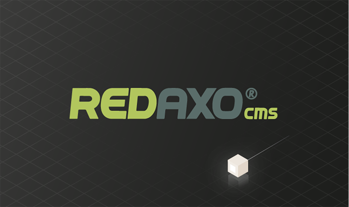

# Redaxo 5.2.0: Remote Code Execution via CSRF

16 Dec 2016 by Robin Peraglie

[Redaxo](https://www.redaxo.org/) 5.2.0 is the latest release of a simple content
management system that is mostly used in Germany. Today we are going to
present our scan results for Redaxo and explain how completely omitting
anti-[CSRF](https://www.owasp.org/index.php/Cross-Site_Request_Forgery_(CSRF)) measures can have a significant security impact.



## RIPS Analysis

When inspecting the charts generated by RIPS, a code execution
vulnerability indicated as *critical* catches our eye. Investigating
this issue closer quickly reveals that the vulnerability lies in the
administrator panel, seemingly nulling the severity of the
vulnerability. We will see later in this post that this is not the case.
All issues were found in exactly 20 seconds inside of \~76,000 lines of
code.

The truncated analysis results are available in our RIPS demo
application. Please note that we limited the results to the issues
described in this post since there are no fixes available.

## Case Study

We will now explain how a *cross-site request forgery* attack might lead
to remote code execution. A second vulnerability-chain will be
presented, a cross-site scripting vulnerability using SQL injection.

### Remote Code Execution

The remote code execution vulnerability lies within an internal cronjob
plugin. Since the cronjob plugin is deactivated by default, our
vulnerability seems to be less severe. However, Redaxo does not make use
of anti-CSRF protection mechanisms allowing an attacker to activate and
install the plugin within a *single* sent HTTP request. The plugin
enables administrators of Redaxo CMS to add cronjobs in form of PHP code
to their site and execute them laterby.

```php
class rex_cronjob_phpcode extends rex_cronjob {
    public function execute() {
        $code = preg_replace('/^\<\?(?:php)?/', '', $this->getParam('code'));
        $is = ini_set('display_errors', true);
        ob_start();
        $return = eval($code);
```

This feature allows the following attack-scenario:
Whenever an authenticated administrator of Redaxo CMS 5.2.0 visits a
malicious page like `www.evil.com`, a client-side language, such as
JavaScript, can send the following two HTTP-requests from the victims
browser:

1.  Activate and install the internal `cronjob`-plugin by sending a GET
    request to the targeted server.
2.  Add a cronjob with malicious PHP-code which will be executed after a
    given period of time by sending a POST request.

These two HTTP-requests now yield in a remote code execution
vulnerability. Note that the given PHP code will be stored in the
SQL-database of Redaxo and not directly in an individual file.

### Cross-Site Scripting

The cross-site scripting vulnerability is located in the internal
structure add-on of Redaxo which is activated by default. It provides
access to a *linkmap* in which user-controlled input flows unsanitized
into JavaScript context allowing an attacker to control the execution
flow of the client-side language.

```php
$opener_input_field = rex_request('opener_input_field', 'string');
$opener_input_field_name = rex_request('opener_input_field_name', 'string');
⋮
// Build JS Functions
⋮
if (substr($opener_input_field, 0, 13) == 'REXLINKLIST') {
    $id = substr($opener_input_field, 13, strlen($opener_input_field));
    $func_body .= 'var linklist = "REX_LINKLIST_SELECT__' . $id . '";
                ⋮
                 opener.writeREXLinklist(' . $id . ');';
} else {
⋮
<?php echo $func_body . "\n" ?>
```

In the given code snippet, the GET-parameter `opener_input_field` is
read from the request in line 5. Then, in line 10, the if-constraint
ensures that the first thirteen characters of the `opener_input_field`
parameter have to be *REX_LINK_LIST*. Finally, in line 11, the first
thirteen characters (*REX_LINK_LIST*) are removed from our input, and
the result is stored in the `$id` variable at line 12 and 14, which is
printed to the HTML response page in line 17. Thus, an attacker can
inject arbitrary JavaScript code that is reflected in a victim's
browser.

The payload can initiate the two previously introduced HTTP requests
that lead to remote code execution. Contrarily to an CSRF attack, the
attacker can prepare an URL that points to the domain of the targeted
Redaxo installation instead of an attacker-controlled domain and, thus,
gain more trust of the victim for visiting the URL.

### SQL Injection

Redaxo allows its users to make a backup of the SQL database. However,
as can be seen in the following, it does not hinder the user to export
any SQL tables not related to Redaxo, which is a great trampoline for us
to further escalate our cross-site scripting vulnerability.

```php
$exporttype = rex_post('exporttype', 'string');
⋮
$EXPTABLES = rex_post('EXPTABLES', 'array');
⋮
if ($exporttype == 'sql') {
    // —————————— FUNC EXPORT SQL
    $header = 'plain/text';
    $hasContent = rex_backup::exportDb($export_path . $filename . $ext, $EXPTABLES);
```

Shortly after retrieving the user input in line 20, the input parameter
`EXPTABLES` is passed unsanitized in the `exportDb()` function which
basically reads all fields and contents of the tables specified by the
`EXPTABLES` array. In the end, the query result is attached to the HTTP
body.

By chaining these two vulnerabilities together an attacker could
potentially dump all databases on the server with a malicious JavaScript
payload and send it to his own server.

## Time Line

| Date | What |
|------|------|
| 2016/09/15 | First contact with vendor |
| 2016/10/25 | Vendor rates the issues as not critical |
| 2016/11/29 | Reminder sent to the vendor about the upcoming blog post |

## Summary

One of the most important conclusions we take by this analysis should be
the appeal to implement anti-CSRF measures for the web application,
specifically for security-critical functionality. In addition to that,
sufficient input sanitization has to be applied - in the frontend as
well as in the administrators panel - to further secure the application
against *remote* attacks.

The vendor does not consider the vulnerabilities severe because they are
located in the administration area of the application and upcoming fixes
are delayed indefinately.
