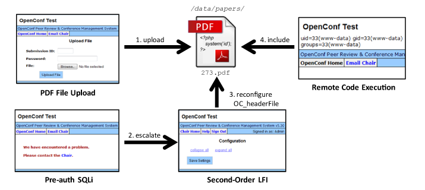

# OpenConf 5.30 - Multi-Step Remote Command Execution

17 Dec 2016 by Johannes Dahse


Today, we present a multi-step command execution vulnerability in the
popular conference management software
[OpenConf](https://www.openconf.com/). The vulnerability was reported and fixed a while ago,
but the chain of 4 exploitation steps involved makes it a very
interesting vulnerability sample for our [advent
calendar](00-apav-advent-of-php-application-vulnerabilities.md).
4 - 3 - 2 - 1 ...

## RIPS Analysis

An early prototype of RIPS detected the issues described in the
following in roughly 24,000 lines of code. OpenConf suffered mainly from
a few SQL injection vulnerabilities, as well as reflected and persistent
cross-site scripting issues. In the following, we focus on the
combination of several issues that in the end lead to the execution of
arbitrary PHP code on the target conference server. This could be abused
to manipulate the call for papers of a conference, as well as to steal
sensitive research.

## Case Study

### 1. File Upload

During the call for papers, any unprivileged user can make a paper
submission to the OpenConf management system. RIPS detected the
following file upload feature.

```php
$uploadDir = $OC_configAR['OC_paperDir'];
⋮
$pid = mysql_insert_id();
⋮
$fileName = $uploadDir . $pid . '.' . $_POST['format'];
oc_saveFile($_FILES['file']['tmp_name'], $fileName, $_POST['format']);
```

```php
function oc_saveFile($src, $dest, $type) {
    if (move_uploaded_file($src, $dest)) {
⋮
```

The upload directory is fixed in the configuration, the file name of the
uploaded paper is a static ID, and the file extension is verified
against a whitelist. By default, a user can only submit a paper of type
PDF. Yet, this finding will be useful later on in our chain.

### 2. Pre-Auth SQL Injection

During the paper submission process, a faulty regular expression `^\d+`
misses to sufficiently validate that only digits are supplied in the
POST parameter `contactid`.

```php
if (!preg_match("/^\d+/", $_POST['contactid']) || ($_POST['contactid'] < 1)
|| ($_POST['contactid'] > $OC_configAR['OCauthorsMax'])) {
    // Check that we have a valid contact author & email
    $err .= '' . oc('Contact author invalid') . '';
}
} else {
    ⋮
    $qfields['contactid'] = safeSQLstr($_POST['contactid']);
}
```

The regular expression only verifies that the `contactid` begins (`^`)
with one or more digits (`\d+`), but does not perform this check over
the full parameter length until its end (`$`). For example, the payload
`1 or 1=1` would successfully bypass the regex because it fulfills the
requirement of beginning with a digit. RIPS was able to detect this
missing character in the regular expression by using an internal regex
parser.

Further, the custom function `safeSQLstr()` is used in line 49 to escape
any quotes within the POST parameter. However, when the `contactid` is
concatenated into the SQL query later, no additional quotes are used as
a delimiter around the value that would allow the SQL parser to
differentiate between data and injected SQL code.

```php
$qfields = array();
⋮
require_once 'submission-validate.inc';
⋮
$q = "INSERT INTO " . OCC_TABLE_PAPER
    . " SET submissiondate='" . safeSQLstr(date("Y-m-d")) . "'"
    . ", lastupdate='" . safeSQLstr(date("Y-m-d")) . "'";
foreach ($qfields as $qid => $qval) {
    $q .= ", " . $qid . "=" . $qval;
}
$r = ocsqlquery($q) or err(oc('unable to process submission'));
```

Hence, an unprivileged user is able to alter the SQL query and to
extract arbitrary database values, including the login credentials. In
OpenConf, the conference *chair* members have administrative privileges.

### 3. Config Manipulation

Once an attacker retrieved the login credentials of a chair member, she
can access the *chair/* functionalities. Here, the file *set_config.php*
allows to manipulate arbitrary config values. Although not all config
values are addressed with an input field in the web interface, arbitrary
config values can be submitted via `$_POST` that are then updated in the
database.

```php
foreach (array_keys($_POST) as $p) {
    if (preg_match("/^OC_[\w-]+$/", $p)
    && isset($OC_configAR[$p]) && ($OC_configAR[$p] != $_POST[$p])) {
        updateConfigSetting($p, $_POST[$p], 'OC');
        $OC_configAR[$p] = $_POST[$p];
    }
}
```

```php
function updateConfigSetting($setting, $value, $module='OC') {
   $q = "UPDATE ".OCC_TABLE_CONFIG." SET value='" . safeSQLstr(trim($value)) . "'"
        . " WHERE module='" . safeSQLstr($module) . "'"
        . " AND setting='" . safeSQLstr($setting) . "'";
   return(ocsql_query($q));
}
```

The config values are fetched from the database in the global
*include.php* file and propagated to `$OC_configAR` again to load the
current configuration.

```php
$r = mysql_query("SELECT setting, value, parse FROM " . OCC_TABLE_CONFIG );
while ($l = mysql_fetch_assoc($r)) {
    $OC_configAR[$l['setting']] = $l['value'];
    ⋮
}
```

What configuration values could an attacker change?

As shown in the first step, an attacker could add *PHP* as a valid file
extension for uploaded papers. Still, because an .htaccess file deny's
direct access to the default upload directory *data/papers/*, the
attacker would have to change the upload directory as well and require
the web server to possess according file permissions.

RIPS was able to detect the second-order data flow through the database
by reconstructing the SQL UPDATE query and by identifying the columns
that can be tainted with POST parameter values. Then, it can check all
usages of the tainted `$OC_configAR` array automatically. Eventually,
RIPS found an easier way for exploitation.

### 4. Second-Order Local File Inclusion

In OpenConf's `printHeader()` function, the `OC_headerFile` config value
is used for the inclusion of a header file. By abusing the configuration
manipulation issue, an attacker that escalated her privileges to a chair
member can set the `OC_headerFile` config value to another file that is
then used for inclusion.

```php
function printHeader($what, $function="0") {
    require_once $GLOBALS['pfx'] . $GLOBALS['OC_configAR']['OC_headerFile'];
```

By using a *path traversal* attack, arbitrary files can be leaked from
the web server. Even worse, the file inclusion can be directed to a file
that contains uploaded PHP code of the attacker. Here, the paper upload
functionality comes in handy again.

### Putting everything together

An attacker can upload a PDF paper that contains PHP code (1), escalate
her privileges via SQL injection to a chair member (2), manipulate the
`OC_headerFile` value to point to his malicious paper file (3), and then
access an OpenConf page that will trigger the inclusion of his PHP code
in the `printHeader()` function. As a result, she can execute arbitrary
system commands on the targeted web server.



### Bonus: Second-Order Command Execution

What else could an attacker do with the manipulated configuration? RIPS
reported a second-order command execution issue that is very similar to
a previously released issue in Roundcube. Find out more about this
vulnerability [in our 6th advent calendar
post](06-roundcube-command-execution-via-email.md).

```php
oc_mail($OC_configAR['OC_pcemail'], $_POST['subject'], $_POST['message'], $hdr);
```

```php
function oc_mail($to, $subject, $body, $hdr = '', $enc = 'quoted-printable') {
    global $OC_configAR;
⋮
    mail($newto, $subject, $body, $headers, $OC_configAR['OC_mailParams']);
```

## Time Line

| Date | What |
|------|------|
| 2014/06/05 | Sent advisory to vendor |
| 2014/06/06 | Vendor reponse |
| 2014/06/09 | Vendor requested more details |
| 2014/06/10 | Vendor sent patch for verification |
| 2014/06/10 | [Vendor released patch](https://www.openconf.com/news/#20140610) |

## Summary

In this calendar gift, we described a chain of multiple security issues
that lead to remote command execution. One single character missing in a
regular expression got the chain started and demonstrated, how subtle
security bugs can be. The combination of several medium-severe security
bugs chained step by step then lead to a highly critical issue. Thus,
all security issues should be addressed, regardless of their severity.
This was done very quickly and professional by the vendor, Zakon Group,
in 2014.
