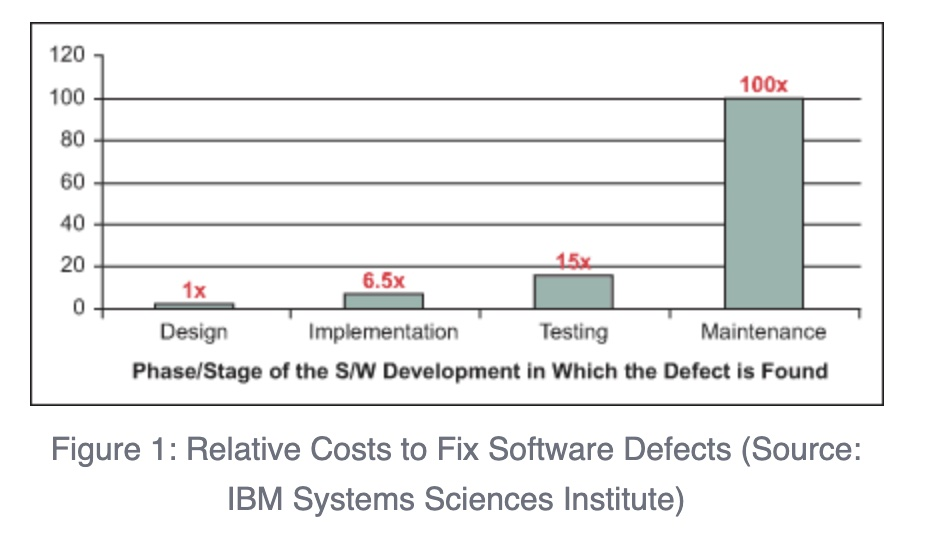

# Continuous Integration - Jenkins at your service

18 Dec 2016 by Daniel Peeren

Continuous integration (CI) is a powerful tool to increase the quality
of software and to save valuable time in the development process. An
integral aspect of continuous integration is the automated testing of
source code to reduce the likelihood of risks, bugs, and errors. In
order to assist developers in writing secure code, it is possible to
connect the sophisticated security analysis of RIPS into existing CI
tools. In this post, we will introduce our plugin for
[Jenkins](https://jenkins.io/),
one of the most popular automation platforms in the world, that can
automatically warn you whenever a new security issue is introduced to
your code base.

## How Continuous Integration works

Continuous integration is the process of - as the name suggests -
continually merging all parts of code changed by developers. The main
purpose of CI is to achieve better productivity and code integrity by
using a shared code repository which is automatically built and tested
by a CI service after code is pushed or committed to the repository.
Better productivity means that nobody has to watch the builds and
everyone saves time for more important things. Hence, if you are
developing an application with a team, it is recommended to use CI.

When using CI, a build can be triggered on various actions. For example,
a *git push* or *git merge* command, as well as a *git commit* of a
developer or a team leader, can be configured as a trigger. Regardless
of how the trigger for the build on the CI service is defined, the
application is built by the service and additional tests can be
performed. As a result, an overall build status can be determined that
notifies about whether the build was successful or terminated with
failures. Further, post-build actions can be configured accordingly. A
code analysis tool can be added in order to watch over the source code's
security for each build.

## The Benefits of adding Security Checks to CI

Application security is a crucial part of the modern development process
in order to protect company assets and customer data. With the help of
static application security testing (SAST) software, code can be
automatically assessed for security issues **without** deploying and
running the code. Depending on the performance of the SAST tool, this
can save valuable time.

As reported by the Systems Sciences Institute, the relative costs of a
software's defects *(Fig. 1)* become more expensive the later the issues
are detected. For example, if an issue generates costs worth of \$100 or
1 working hour in the earliest stage of development, the costs of the
same issue can rise up to \$10,000 or 100 working hours in the latest
stage. Ideally, security testing of source code is added as an integral
part of the development process from the start in order to minimize
these expenses.

**Fig. 1:** Relative costs to fix software defects in different
development stages. Source: IBM Systems Sciences Institute

## Continuous Integration and RIPS

With RIPS' unique analysis performance that only lasts a few minutes
instead of hours or days, it is possible to detect and fix security
issues as fast as possible and to spend saved time on valuable
development tasks. Furthermore, RIPS is able to provide [real-time
analysis
results](https://www.ripstech.com/features/#realtime-results)
such that detected security vulnerabilities can be addressed directly
without waiting for the analysis to complete.

But how can the powerful security analysis of RIPS be integrated into
your CI process? The answer is simple. With the help of a CI plugin,
e.g. for Jenkins, an automated [security
rescan](/web/20180110051552/https://blog.ripstech.com/2016/rescanning-applications-with-rips/)
with RIPS can be set up in your CI tool. The plugin is integrated into
the environment and able to analyze the repositories you are already
using. As a result, vulnerability statistics and trends are directly
displayed in your Jenkins interface without any change in your current
work flow. The security state of your code repository is observed and it
becomes easier to track and remediate security issues. **Our plugin is
also able to alarm you via email in case severe issues of a certain
threshold are detected.**

Figure 2 shows an example of the *project view* in Jenkins. In the
center, the success or failure state of the latest build is shown. The
state bases on your personal configuration. For example, the build
status can be set to failure whenever a security issue is detected whose
severity is higher than *medium*. On the right, statistics about the
severity of the detected issues in the latest scan are given, as well as
an overall vulnerability trend of the development to track your
progress. In order to investigate the detected issues, the *detailed
report* button jumps directly into the RIPS analysis interface.

The following video demonstrates how a repository is updated with
*secure* and with *vulnerable* code via git commits. After each code
change, a code analysis with RIPS is triggered by Jenkins that alarms
about possible vulnerabilities.

## Summary

Software development must be kept efficient, easy, and manageable.
However, the challenge of writing secure software is often hardly
compatible with these goals. By integrating a powerful code analysis
tool into the existing CI process, security issues can be automatically
detected in the background and warn about the application's risk state.
The earlier the security issues are detected in the development process,
the easier and cost efficient they can be resolved.

In this post, we introduced the integration of RIPS into the popular CI
tool Jenkins. We illustrated how an in-depth security analysis with RIPS
can be executed automatically for each build and how RIPS can
significantly boost and ease your secure development. By using our
[extensive
API](https://api.ripstech.com/),
RIPS can be integrated into any other CI tool or analysis environment as
well.
