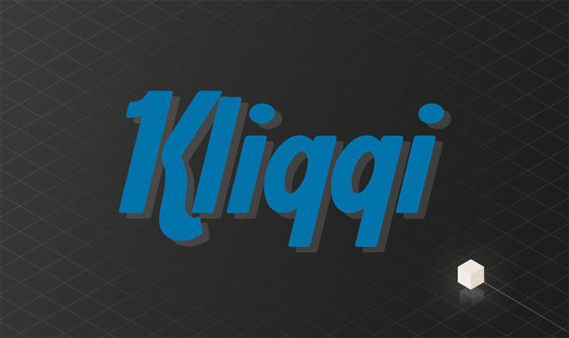

# Kliqqi 3.0.0.5: From Cross-Site Request Forgery to Code Execution

20 Dec 2016 by Martin Bednorz

Today's gift in our advent calendar contains descriptions of
vulnerabilities in
[Kliqqi](http://www.kliqqi.com/), the successor to the popular Pligg CMS mostly used for
the creation of interactive social communities. Due to missing CSRF
protection, an attacker is able to prepare a website that ultimately
leads to code execution on the applications server when visited by a
target.



## RIPS Analysis

RIPS' analysis of the \~77,000 lines of Kliqqi code took only 31 seconds
to complete and was able to discover several risks within the
application. There were no critical vulnerabilities found directly but
it is possible to escalate one high-rated security issue to a critical
one - as we are going to demonstrate in the following case study.

The truncated analysis results are available in our RIPS demo
application. Please note that we limited the results to the issues
described in this post in order to ensure a fix is available.

## Case Study

In this case study we are going to present a chain of vulnerabilities
that ultimately lead to code execution on the attacked server by

1.  installing the *upload* module,
2.  allowing *.php* extensions in the upload module,
3.  and uploading a malicious PHP file.

### Install / Activate Upload Module

The installation of a module by an Kliqqi administrator requires only a
few HTTP GET requests. Hence, a very simple malicious link can be
crafted that is able to install arbitrary modules in the application. It
is sufficient to lure an administrator into clicking this link to
install the *upload* module that is required for the vulnerability chain
explained in this post. Exploitation of this security issue is possible
due to the fact that there is no sufficient protection against
[cross-site request
forgery](https://www.owasp.org/index.php/Cross-Site_Request_Forgery_(CSRF)) attacks. The referrer check shown in the code summary
below can be easily bypassed.

```php
function check_referrer($post_url=false) {
    ⋮
    if (strpos(preg_replace('/^.+:\/\/(www.)?/','',$_SERVER['HTTP_REFERER']).'/',
    preg_replace('/^.+:\/\/(www.)?/','',$my_base_url))!==0) {
        unset($_SESSION['xsfr']);
        die("Wrong Referrer '{$_SERVER['HTTP_REFERER']}'");
    }
```

The regular expressions in both calls to `preg_replace()` only remove
the protocol and *www* subdomain used for the request and base url in
the variable `$my_base_url`. By default, when Kliqqi is installed at the
domain `www.example.com`, the `$my_base_url` variable is set to
`http://www.example.com`. Now, the `if` statement checks whether the
base url is positioned at the beginning of the HTTP referrer. This check
can be easily circumvented by simply prepending the domain of the
targeted application to the attacker controlled domain as a subdomain.
In our example, an attacker can circumvent the referrer check by using
the following domain: `http://example.com.attacker.com`. First, the
`$my_base_url` variable and the referrer are striped to `example.com`
and `example.com.attacker.com` respectively. Obviously, the check
whether `example.com` is at the beginning of `example.com.attacker.com`
via the `strpos()` function succeeds.

In general, relying on the HTTP referrer should be avoided because it
can be easily manipulated by malicious users and oftentimes it is not
available at all (company proxy etc.). It is recommended to use CSRF
tokens for proper security.

### Allow PHP Extension for Uploads

This step is even simpler than the previous one, as the referrer check
is not executed in this particular module. With JavaScript and CSRF it
is possible to perform a simple POST request to
`module.php?module=upload` on a client with administration privileges to
add new extensions that are allowed within the upload module. As a
result, it is possible to upload arbitrary PHP files to the targeted web
server by any user in the social community. Similar to the previous
step, CSRF tokens should be used in order to prevent this type of
attack. In addition, it should not be allowed to change the file
extension whitelist arbitrarily in order to prevent the upload of
malicious PHP files.

### Upload PHP Files

Once the attacker added `php` to the allowed extension list as described
in the previous steps, it is possible to upload arbitrary PHP code by
using the following file upload functionality.

```php
function upload_save_files() {
    $settings = get_upload_settings();
    $extensions = preg_split('/[ ,.]+/',$settings['extensions']);
    ⋮
    $tmp_name = $_FILES["upload_files"]["tmp_name"][$key];
    $name = $_FILES["upload_files"]["name"][$key];
    if ($ext = strrchr($name,'.')) {
        $name = str_replace($ext,'',$name);
        $ext  = substr($ext,1);
    }
    if ($ext && in_array(strtolower($ext),$extensions)) {
        if (@move_uploaded_file($tmp_name, "$upload_dir/$name.$ext")) {
⋮
function get_upload_settings() {
    $sql = "SELECT * FROM ".table_prefix."misc_data WHERE `name` like 'upload%'";
    $settings = $db->get_results($sql);
    ⋮
```

Here, the allowed file extensions in the validation check in line 197
are read from the database in line 201, making it possible to upload PHP
files. Once again, as demonstrated in several previous blog posts, a
file upload causes the trouble.

### Putting it all together

All of the attack steps described in the case study above can be
packaged into a single JavaScript payload because of the missing CSRF
protection. In addition, there is no cross-site scripting issue required
on the attacked application itself and all of the payload can be
executed via a malicious website prepared by an attacker. The only
prerequisite is that he has to lure a privileged user onto his website
so that the payload can be executed invisible in the background, which
in most cases requires only a handful of social engineering.

## Time Line

| Date | What |
|------|------|
| 2016/10/24 | First try to contact vendor |
| 2016/11/16 | Second try to contact vendor |
| 2016/11/16 | Vendor responded |
| 2016/12/17 | [Vendor released a fixed version](http://www.kliqqi.com/upgrade-to-kliqqi-v3-5-now/) |

## Summary

Cross-site request forgery protection is critical to remedy
vulnerability chains such as the one presented in this blog post. In
addition, allowing the upload of (basically) user-defined file
extensions is never a good idea. Instead, the file extension whitelist
should be more strict and under no circumstances allow PHP files to be
uploaded in order to prevent malicious code execution. We thank the
vendor for the professional handling of these issues and for providing
security patches.
